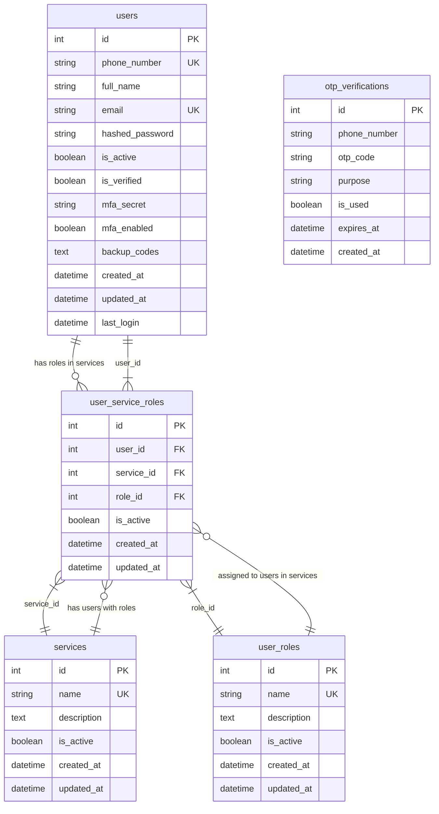

# Database Schema Diagram - ElectraApp User Service

## Entity Relationship Diagram



## Table Descriptions

### 1. **users** (Main User Entity)
- **Primary Key**: `id`
- **Unique Constraints**: `phone_number`, `email`
- **Key Features**:
  - Phone-based authentication system
  - MFA support with secret keys and backup codes
  - Email verification system
  - Activity tracking with last login timestamp

### 2. **user_roles** (Role Definitions)
- **Primary Key**: `id`
- **Unique Constraints**: `name`
- **Purpose**: Defines available roles in the system
- **Default Roles**: admin, user, manager, moderator

### 3. **services** (Service Definitions)
- **Primary Key**: `id`
- **Unique Constraints**: `name`
- **Purpose**: Defines different services in the ElectraApp ecosystem
- **Default Services**: userService, tradeService

### 4. **user_service_roles** (Junction Table)
- **Primary Key**: `id`
- **Foreign Keys**: `user_id`, `service_id`, `role_id`
- **Unique Constraint**: `(user_id, service_id)` - One role per user per service
- **Purpose**: Maps users to specific roles within specific services

### 5. **otp_verifications** (OTP Management)
- **Primary Key**: `id`
- **Purpose**: Handles OTP verification for registration, login, and password reset
- **Features**: Expiration tracking, usage status, purpose categorization

## Key Relationships

1. **User → User Service Roles** (1:N)
   - A user can have multiple service roles (one per service)

2. **Service → User Service Roles** (1:N)
   - A service can have multiple users with different roles

3. **Role → User Service Roles** (1:N)
   - A role can be assigned to multiple users across different services

4. **Unique Constraint**: Each user can have only ONE role per service

## Architecture Benefits

- **Scalability**: Easy to add new services and roles
- **Flexibility**: Users can have different permissions per service
- **Security**: Role-based access control per service
- **Maintainability**: Clean separation of user identity and permissions
- **Multi-tenancy Ready**: Supports expansion to multiple services

## Sample Data Flow

```
User Registration:
1. Create user in `users` table
2. Send OTP via `otp_verifications` table
3. Assign default role in userService via `user_service_roles` table

Role Assignment:
1. Check if user exists in `users`
2. Check if service exists in `services`
3. Check if role exists in `user_roles`
4. Create/Update entry in `user_service_roles`
```

## Database Constraints

- **Foreign Key Constraints**: Ensure referential integrity
- **Unique Constraints**: Prevent duplicate phone numbers, emails, and role names
- **Check Constraints**: Ensure valid data (e.g., active boolean values)
- **Composite Unique Constraint**: One role per user per service